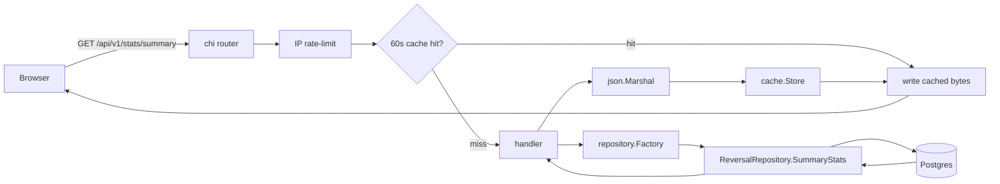

# Reverse Watch — Local Environment

Last verified: 2026-05-23.

## Stack you need installed

- macOS (this doc is macOS-specific; CI is Ubuntu).
- Go 1.24+ (`go version` to check).
- PostgreSQL 18 via Homebrew (`brew install postgresql@18 && brew services start postgresql@18`).
- `gh` (GitHub CLI) for PR work.

## One-time Postgres setup

The repo's tests (`internal/testutil/db.go`) hardcode user `postgres`, password `postgres`, host `localhost:5432`. This matches CI (`.github/workflows/test.yml`). Don't change those test-side credentials — match locally instead:

```bash
psql -d postgres -c "ALTER USER postgres WITH SUPERUSER PASSWORD 'postgres';"
```

(If the `postgres` user doesn't exist yet on your install, swap `ALTER` for `CREATE`.)

Verify with:

```bash
PGPASSWORD=postgres psql -U postgres -h localhost -d postgres -c "SELECT current_user;"
```

Expected: a row showing `postgres`. If you get a password failure, the above ALTER didn't take.

## App config (`config.json`)

`config.json` is gitignored. Current local setup:

```json
{
  "Database": {
    "Host": "localhost", "Port": "5432",
    "User": "byskov", "Password": "devpassword",
    "PrivateDBName": "reverse_watch_private",
    "PublicDBName":  "reverse_watch_public"
  },
  "HTTP":        { "Port": "8080", "AllowedOrigins": ["http://localhost:8080"] },
  "Environment": "development"
}
```

Note the **app** uses Morten's user (`byskov/devpassword`) but **tests** use `postgres/postgres`. Both work; they hit different databases.

## Day-to-day commands

| Goal                           | Command                                                  |
|--------------------------------|----------------------------------------------------------|
| Boot the dev server            | `go run main.go` (runs at `http://localhost:8080/`)      |
| Run full test suite            | `go test ./...` (~15s, all packages)                     |
| Run one package's tests        | `go test ./repository/public/...`                        |
| Run one test by name           | `go test ./repository/public/ -run TestSummaryStats -v`  |
| Compile-only check (no run)    | `go build ./...`                                         |
| Format on save                 | Your editor should do this; `gofmt -w .` if not          |

## Workflow gotchas

- **Two terminals.** Keep one terminal alive for `go run main.go`. Use a second one for shell commands. Pasting `git`/`go test` into the dev-server terminal silently goes to the server's stdin, not the shell.
- **Don't push to `master`.** It's protected on `csfloat/reverse-watch`. Always branch + PR. Current dev branch: `feature/public-dashboard-v1`.
- **CI is identical to local tests.** If `go test ./...` is green locally, CI will be green.

## When something's wrong — debug ladder

1. `brew services list` — is Postgres running?
2. `PGPASSWORD=postgres psql -U postgres -h localhost -d postgres -c "SELECT 1;"` — can I authenticate?
3. `go env GOPATH GOROOT` — is Go on the right version?
4. `go mod download` — are deps in place?
5. Talk to the agent. Don't power through silently.

---

# Project Summary (for a reviewer's first pass)

## What this branch adds

`feature/public-dashboard-v1` ships the public Reverse Watch dashboard at `/`: three public read endpoints plus a single-file frontend. No schema changes, no new services, no new dependencies. The existing Steam-ID lookup (`/api/v1/users/{steamId}`) is unchanged.

The three new endpoints:

| Method | Path                                  | Purpose                                                      |
|--------|---------------------------------------|--------------------------------------------------------------|
| GET    | `/api/v1/stats/summary`               | KPI totals (indexed, flagged, flagged-24h). 60s cache.       |
| GET    | `/api/v1/stats/reversals/daily`       | Daily reversal counts. `?days=7\|30\|60\|90\|180\|365`. 60s cache. |
| GET    | `/api/v1/reversals/recent`            | Last N (≤100) reversals, newest first. Uncached.             |

All three are IP-rate-limited via the existing `ratelimit.ThrottleByIP` middleware (60/min on `/stats/*`, 30/min on `/recent`).

## Where things live

```
domain/
  dto/stats.go                          ─ SummaryStats, DailyCount response shapes
  repository/public.go                  ─ added 3 method signatures to ReversalRepository

repository/public/reversal.go           ─ SummaryStats, DailyCounts, ListRecent (+ tests)

api/v1/
  v1.go                                 ─ mounts /stats next to existing /reversals
  stats/{router,stats,stats_test}.go    ─ new /stats group + 60s in-process cache
  reversals/router.go                   ─ restructured: /recent is public, others stay auth-gated
  reversals/reversals.go                ─ listRecentHandler (subset DTO, not full models.Reversal)
  reversals/reversals_recent_test.go    ─ handler tests + response-shape golden

server/server.go                        ─ serveStaticFile / staticDirHandler
                                          (workaround for macOS sendfile truncation)

static/
  index.html                            ─ single-file dashboard, no build step
  csfloat-logo.png                      ─ asset
  cs2-events.json                       ─ editorial chart annotations (date+title+description)

internal/devseed/
  fixtures/reversals_seed.csv           ─ 98-row real-data fixture
  sheet.go                              ─ CSV loader + chunked InsertReversals
  synthetic.go                          ─ deterministic 6-month / ~9,800-row generator
cmd/seed/main.go                        ─ CLI for both seeds; refuses non-development env
```

## Request flow



`/reversals/recent` is the same shape minus the cache branch. The frontend (`static/index.html`) calls all three on boot and re-fetches daily counts when the period picker changes.

## Notable design decisions

- **IP rate-limit reuses existing middleware.** `ratelimit.ThrottleByIP` is the same primitive that gates `/api/v1/users/{steamId}` — no new infra, no new config surface.
- **60s in-process cache for `/stats/*`.** A `sync.Map` keyed by request shape, sized to ≤8 keys (one per allowed `days` value + summary). Good enough for v1; if traffic grows we can move to Redis without changing the contract.
- **`/recent` lives under `/reversals` but `/reversals/daily` lives under `/stats`.** `/recent` is row-level data; `/stats/reversals/daily` is an aggregate with a different cache policy. Same comment lives in [api/v1/v1.go](../../api/v1/v1.go).
- **Synthetic seed is gated on `Environment=development`.** `cmd/seed` refuses to run otherwise; production cannot accidentally insert fake data. The generator (`internal/devseed/synthetic.go`) is deterministic (RNG seed 42), so dev environments are reproducible.
- **Static handler reads-per-request.** `server/server.go` skips `http.ServeFile` because the sendfile fast path truncated responses at the first TCP segment on local macOS during development. The files are small enough that re-reading per request is cheap.
- **Frontend is one file, no build step.** Inline CSS + JS, `uPlot` loaded from CDN. Easy to review, easy to ship, no toolchain to maintain. If we outgrow this, the contract with the backend is the JSON shapes — the frontend can be rewritten independently.

## Known gaps that need a product call

These are intentional v1 stopgaps. Pointers to PRD sections in [docs/dashboard/PRD.md](PRD.md):

- **D-open-1: KPI definitions.** Confirm `traders_indexed` = distinct steam_ids in the index (current implementation). PRD §14.1.
- **D-open-4: Steam display-name source.** The Trader column currently shows deterministic *fake* names derived from `steam_id`. Real names need either Steam `GetPlayerSummaries` (rate-limited, needs caching) or a separate `steam_users` table. PRD §14.4.
- **Marketplace registry behavior.** PRD §14.4 flags some ambiguity about whether/how to display marketplace slugs.

## How to run locally

```bash
# 1. One-time: ensure the test user exists (see top of this file).
psql -d postgres -c "ALTER USER postgres WITH SUPERUSER PASSWORD 'postgres';"

# 2. Seed the local public DB (idempotent; safe to re-run).
go run ./cmd/seed                  # 98 real-data rows from the Google Sheet export
go run ./cmd/seed -synthetic       # +9,800 synthetic rows spanning 6 months

# 3. Run the server.
go run main.go                     # open http://localhost:8080
```

Tests: `go test ./...` (~15s).
