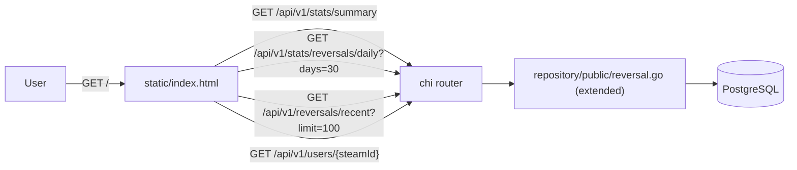

# Reverse Watch — Build Handoff

**Purpose:** Everything a Cursor agent (or Morten) needs to start building the Reverse Watch dashboard inside the cloned [`csfloat/reverse-watch`](https://github.com/csfloat/reverse-watch) repo. Self-contained — designed to be copied into the new workspace alongside `PRD.md` so the dialogue doesn't need to carry over.

**Travel as a pair:**
- `PRD.md` — the final product spec (read first, authoritative).
- `HANDOFF.md` — this file (build plan, context, next steps, how to work).

---

## 0. Starter prompts

For session kickoff, use `START-CHAT.md` in this folder. For session wrap-up, use `END-CHAT.md`. The earlier starter prompt that lived here is preserved in git history.

---

## 1. One-paragraph project summary

Reverse Watch's public site at `reverse.watch` is currently a single Steam-ID lookup served from `static/index.html` by a Go binary (chi + GORM + Postgres). We're turning it into a public dashboard: hero + search (existing flow, restyled) + three KPI cards + a 90-day daily-reversal-count line chart + a "recently reported reversals" table + footer. Everything is additive — three new public read endpoints, three new repo methods, one rewritten HTML file. No schema changes, no migrations, no new services. Morten is building it himself; goal is "second project shipped at CSFloat" and to learn the reverse-watch stack end-to-end.

---

## 2. How to work with Morten

See `ABOUT-MORTEN.md` in this folder. ABOUT-MORTEN is authoritative for working style.

---

## 3. Decisions locked in (don't re-open without Morten)

| #   | Decision                                                                                                            | Rationale                                                                                                |
| --- | ------------------------------------------------------------------------------------------------------------------- | -------------------------------------------------------------------------------------------------------- |
| D1  | Build inside `csfloat/reverse-watch` as additive routes + a static HTML rewrite. No new repo, no new service.        | Repo is small and purpose-built. Adding scope here is the right home.                                    |
| D2  | New public endpoints follow the `/api/v1/users/{steamId}` precedent: IP-rate-limited via `ratelimit.ThrottleByIP`, no auth, conservative response shapes. | Existing pattern, already proven, already deployed.                                                      |
| D3  | Three new endpoints: `/api/v1/stats/summary`, `/api/v1/stats/reversals/daily`, `/api/v1/reversals/recent`.            | One per UI section. Single network round-trip per section.                                               |
| D4  | Default chart window: **30 days**. `days` param accepts `30 \| 60 \| 90`.                                            | Matches Razvan's mockups (all four PNGs read "Last 30 days"). Enumerated set lets us cache trivially.    |
| D5  | KPI summary and daily endpoints get a 60s in-process cache. Recent-reversals stays uncached.                          | KPIs are stale-tolerant; the table should feel live.                                                     |
| D6  | Frontend stays a single self-contained `static/index.html` — inline CSS, inline JS, charting via CDN.                | Matches existing repo convention. No frontend toolchain to maintain.                                     |
| D7  | Charting library: `uPlot` (preferred — small, fast, no deps) or `Chart.js` (more familiar). Decide in PR #2 review.   | Lock at PR #2 time, not now. Both are CDN-friendly.                                                      |
| D8  | "Load More" on the recent-reversals table is **deferred to v1.1**. v1 fetches 100 rows once.                         | Cursor pagination already exists internally but exposing it on the public route adds surface to v1.      |
| D9  | Marketplace slug → `{name, iconUrl}` mapping is hardcoded in the frontend for v1. Promote to an endpoint in v1.1.    | List is small. Don't pre-build.                                                                          |
| D10 | English only. No i18n in v1.                                                                                         | The repo has no Crowdin wiring. Adding it would balloon scope.                                           |
| D11 | Dark theme only. No light variant.                                                                                   | Razvan's mockups are dark only.                                                                          |
| D12 | "Date Added" column on the recent-reversals table = `created_at` (when reported), not `reversed_at`.                  | The label reads "Added", not "Reversed". Matches the column's intent.                                    |

D-list items still **open** (need Zach input — see §10):

- **D-open-1** KPI definitions (PRD §6.2). Specifically: 24h KPI bucketed by `created_at` vs `reversed_at`.
- **D-open-4** Steam display name source for the Trader column (PRD §6.4). Options: Steam Web API + cache, a `steam_users` table, or "ship without display names in v1." Current local dashboard renders a deterministic fake derived from `steam_id` as a stopgap.

(D-open-2 and D-open-3 are now locked — see PRD §14: recent-reversals Steam IDs ship unmasked; analytics is PostHog via `science.csfloat.io`.)

---

## 4. Architecture — the whole thing on one page



No new services. Zero schema changes. Zero new tables.

---

## 5. File layout inside reverse-watch

```
api/v1/
  stats/
    router.go                    # NEW — chi.Router for /stats/* (mount from api/v1/v1.go)
    stats.go                     # NEW — handlers: summaryHandler, dailyHandler
    stats_test.go                # NEW
  reversals/
    router.go                    # MODIFY — register GET /recent with public IP rate limit
    reversals.go                 # MODIFY — add listRecentHandler (slim public projection)
    reversals_test.go            # MODIFY — coverage for the new handler

repository/public/
  reversal.go                    # MODIFY — add SummaryStats, DailyCounts, ListRecent
  reversal_test.go               # MODIFY — coverage for the three new methods

domain/repository/
  public.go                      # MODIFY — add the new method signatures to the interface

static/
  index.html                     # REWRITE — new layout per the three Razvan mockups

internal/devseed/                # NEW — seed script for local dev (see PRD §3.5)
  sheet.go                       # ingests the Google Sheet CSV into Postgres
  fixtures/
    reversals_seed.csv           # 100-row Sheet snapshot (gitignored if too large)

cmd/seed/                        # NEW
  main.go                        # CLI: `go run ./cmd/seed` — loads from the Google Sheet
```

---

## 6. Endpoint contracts (the source of truth lives in PRD §6)

### `GET /api/v1/stats/summary`

```json
{ "traders_indexed": 25678, "traders_flagged": 15536, "traders_flagged_24h": 6456 }
```

### `GET /api/v1/stats/reversals/daily?days=30`

```json
{
  "data": [
    { "date": "2026-02-22", "count": 12 },
    { "date": "2026-02-23", "count": 18 }
  ]
}
```

- Bucket by `reversed_at` in **UTC**.
- Exclude `expunged_at IS NOT NULL`.
- Include zero-count days inside the window.

### `GET /api/v1/reversals/recent?limit=100`

```json
{
  "data": [
    {
      "marketplace_slug": "csfloat",
      "steam_id": "76561198000000000",
      "reversed_at": 1779840000000,
      "created_at": 1779843600000
    }
  ]
}
```

- Order: `created_at DESC`.
- Exclude expunged.
- Cap `limit` at 100.

---

## 7. What to build first — PR #1 scope (backend only)

Keep PR #1 < ~600 LOC if possible. Big first PRs are a tell.

**In scope:**
- New repo methods on `repository/public/reversal.go`:
  - `SummaryStats() (*dto.SummaryStats, error)` — three counts in one query if reasonable, else three queries inside one transaction.
  - `DailyCounts(days int) ([]dto.DailyCount, error)` — postgres `date_trunc('day', to_timestamp(reversed_at / 1000))` + `generate_series` for zero-fill, or do the zero-fill in Go.
  - `ListRecent(limit int) ([]*models.Reversal, error)` — order by `created_at DESC`, exclude expunged.
- New `dto.SummaryStats` and `dto.DailyCount` structs.
- Add the methods to `domain/repository/public.go`'s `ReversalRepository` interface.
- New `api/v1/stats/router.go` + `stats.go` with the two stats handlers, mounted from `api/v1/v1.go` at `/stats`.
- New `listRecentHandler` in `api/v1/reversals/reversals.go` registered as `GET /` on a public sub-router (or as a separate `/recent` path — see PR review for which mounts cleaner with the existing auth-gated routes).
- 60s in-process cache wrapper around the two stats handlers (per `days` value for the daily one).
- IP rate limiting on all three new endpoints via `ratelimit.ThrottleByIP`. Suggested: 60/min for stats, 30/min for `/reversals/recent`.
- Tests for all three repo methods using `pgtestdb` (see [`internal/testutil/db.go`](https://github.com/csfloat/reverse-watch/blob/master/internal/testutil/db.go)).
- Tests for all three handlers (mirror [`api/v1/reversals/reversals_test.go`](https://github.com/csfloat/reverse-watch/blob/master/api/v1/reversals/reversals_test.go)).

**Not in PR #1:**
- The `static/index.html` rewrite (PR #2).
- Analytics wiring (PR #3).
- Local seed scripts (separate PR or on a side branch — useful for testing locally before PR #2 lands).

**Acceptance for PR #1:** all three endpoints respond with the documented JSON shape. CI passes. Local Postgres seeded from the Google Sheet (per PRD §3.5) shows the documented JSON shape — counts will be small (single marketplace, 3 days of data), and that's fine. Latency feels fine on a dev box (target <500ms p95 in prod).

---

## 8. Local setup on macOS

```bash
brew install go postgresql gh
gh auth login                              # GitHub.com, HTTPS, web browser

mkdir -p ~/code && cd ~/code
gh repo clone csfloat/reverse-watch
cd reverse-watch

# Branch off master (master is protected — must PR back)
git checkout -b feature/public-dashboard-v1

# Postgres setup (or use Docker)
brew services start postgresql@18
createdb -U postgres reverse_watch_dev    # may need: psql -U postgres -c "CREATE USER postgres SUPERUSER;"

# Config
cp config.example.json config.json
# edit config.json: PrivateDBName + PublicDBName, port, etc.

# Run
go mod download
go run main.go
```

Open `http://localhost:80` (or whichever port from `config.json`). Should see the existing Steam-ID lookup page.

**Run the seed locally** (after `internal/devseed/` lands — early-side-branch is fine):

```bash
go run ./cmd/seed --csv=./internal/devseed/fixtures/reversals_seed.csv
```

See PRD §3.5 for the dummy-data rationale. See §10 below for the Sheet ingest gotcha (steam IDs as scientific notation on CSV export).

**Tests:**

```bash
go test ./...
```

Tests use `pgtestdb` and need a running Postgres on `localhost:5432` with `postgres/postgres` creds — same as the CI service. See [`.github/workflows/test.yml`](https://github.com/csfloat/reverse-watch/blob/master/.github/workflows/test.yml).

**Known risks:**
- Branch is off **protected** master. Push to your branch, open a PR, do not push to master.
- `go.mod` requires Go 1.24+. Confirm `go version` before `go mod download`.

---

## 9. Files in reverse-watch to read first (in this order)

1. [`README.md`](https://github.com/csfloat/reverse-watch/blob/master/README.md) — repo overview.
2. [`main.go`](https://github.com/csfloat/reverse-watch/blob/master/main.go) — wiring, ingestor manager, server bootstrap.
3. [`server/server.go`](https://github.com/csfloat/reverse-watch/blob/master/server/server.go) — chi setup, CORS allow-list (note: it restricts methods to `GET, OPTIONS` — ours are GETs so we're fine).
4. [`api/v1/v1.go`](https://github.com/csfloat/reverse-watch/blob/master/api/v1/v1.go) — top-level v1 router; this is where we mount `/stats`.
5. [`api/v1/users/users.go`](https://github.com/csfloat/reverse-watch/blob/master/api/v1/users/users.go) + [`router.go`](https://github.com/csfloat/reverse-watch/blob/master/api/v1/users/router.go) — the precedent for a public, IP-rate-limited handler. Read both end-to-end.
6. [`api/v1/reversals/reversals.go`](https://github.com/csfloat/reverse-watch/blob/master/api/v1/reversals/reversals.go) + [`router.go`](https://github.com/csfloat/reverse-watch/blob/master/api/v1/reversals/router.go) — auth-gated patterns; our new public `recent` handler lives in this package.
7. [`repository/public/reversal.go`](https://github.com/csfloat/reverse-watch/blob/master/repository/public/reversal.go) — extend with three new methods.
8. [`domain/repository/public.go`](https://github.com/csfloat/reverse-watch/blob/master/domain/repository/public.go) — add the new method signatures to the interface.
9. [`internal/testutil/db.go`](https://github.com/csfloat/reverse-watch/blob/master/internal/testutil/db.go) — `pgtestdb` test setup; mirror it.
10. [`static/index.html`](https://github.com/csfloat/reverse-watch/blob/master/static/index.html) — current self-contained file. The rewrite preserves the file structure: inline CSS, inline JS, no build step.

---

## 10. Open items — fire these off today, don't block on them

These are parallel threads. Send the messages, keep coding.

### To Zach — primary reviewer for Reverse Watch

> Setting up the Reverse Watch dashboard rewrite. One thing I want your input on before I open PR #1:
> 1. KPI definitions on the homepage cards. "Traders Indexed" I'm reading as `COUNT(DISTINCT steam_id)` including expunged. "Traders Flagged" as the same but `WHERE expunged_at IS NULL` (matches the existing `/users/{steamId}` `has_reversed` logic). "Traders Flagged (24h)" I want to bucket by `created_at` in the last 24h, not `reversed_at` — because reporters can backfill `reversed_at` weeks ago. OK?

### To Stepan (Discord: `step7750`) — repo author / architecture lead

FYI message — keep him in the loop:

> Heads up — I'm building the Reverse Watch dashboard rewrite. Zach is reviewing. Three new public IP-rate-limited endpoints on top of the existing routes, no schema changes. PRD + HANDOFF live in `docs/dashboard/`. Yell if anything looks off.

### To Ceegan (Discord: `_perplex`) — co-founder, can sanity-check the PRD

> Drafting a v1 dashboard for `reverse.watch`. PRD is in my notes — want me to walk you through it for 10 min, or fire and forget once Stepan's reviewed?

### To Razvan (Discord: `razvanbadea`) — design

> Three q's on the Reverse Watch mockups:
> 1. Got the mobile clear-state mockup — thanks. Need mobile default + mobile flagged before I start PR #2 on the frontend. Same fidelity as the clear one is fine.
> 2. The "RZBO" placeholder — do you have icons / display names for the active marketplaces (csfloat, …), or do I source them?
> 3. Confirming dark only, no light theme variant — yes?

### Sheet access — resolved 2026-05-22

Sheet ID: `1ccGoHiqXTpjy_jtHSOW3QmrNFP2jvfOsqyWFpNBz-UA`. Shared with `cursor-mcp-sheets@csfloat-mcp.iam.gserviceaccount.com`. 100 rows, headers identical to `models.Reversal`.

**Ingest gotcha to bake into the seed script:** 2 of the 100 `steam_id` cells were truncated to scientific notation (`7.65612E+16`) in the default `FORMATTED_VALUE` Sheets response. When pulling via the Sheets API call `valueRenderOption=UNFORMATTED_VALUE`. When using a CSV export, force the `steam_id` column to plain text in Sheets first (`Format → Number → Plain text`) before downloading, otherwise the export will encode scientific notation as a literal string.

The dataset is also narrow in shape — every row is `marketplace_slug=csfloat` and `source=0` (direct), no expunged rows, ~3 days of data. The synthetic generator is responsible for breadth (mixed marketplaces, mixed sources, ~5% expunged, 90-day spread).

---

## 11. Linear

- Linear parent issue: **CSF-1518** — [https://linear.app/csfloat/issue/CSF-1518/improve-reversewatch](https://linear.app/csfloat/issue/CSF-1518/improve-reversewatch)
- Owner: Morten.
- Reviewer: **Zach** (Stepan is repo author / architectural reviewer if needed).
- Sub-issues to open under the parent:
  1. Local setup + onboarding to `reverse-watch` (tracking-only).
  2. PR #1 — three public endpoints + repo methods + tests.
  3. PR #2 — `static/index.html` rewrite consuming the three endpoints.
  4. PR #3 — analytics wiring (PostHog).
  5. (Side branch) — local seed script (`internal/devseed/`, `cmd/seed/`) — loads the Google Sheet per PRD §3.5.

---

## 12. Out of scope — don't do these in v1

- New database tables, columns, or indexes (we may add an index on `reversals(reversed_at)` later; benchmark first).
- Auth-gated dashboards, marketplace login, leaderboards.
- Per-marketplace or per-source breakdowns on the chart.
- "Load More" pagination on the recent-reversals table.
- Public marketplace registry endpoint.
- Light theme.
- i18n / translations.
- Mobile app integration (the extension already integrates).
- Caching beyond a 60s in-process TTL (no Redis, no CDN headers — those land in v1.2).

All of the above live on the Roadmap (PRD §10). Do them only after v1 is live.

---

## 13. Success definition for v1

A user lands on `https://reverse.watch/` and sees: hero with the Steam-ID search, three KPI cards with non-zero numbers, a 90-day reversal-volume line chart, the latest 100 reports as a table, and the new footer. They search a Steam ID and get either *Clear* or *Flagged* below the search box. The page scores ≥ 90 on Lighthouse Performance + Accessibility. PostHog (or chosen analytics) shows `dashboard_viewed` events flowing.

That's it. Celebrate that. Everything else comes after.

---

## 14. Pointers

- **Product spec:** `PRD.md` (this same folder; copy with this file).
- **Repo:** [`csfloat/reverse-watch`](https://github.com/csfloat/reverse-watch).
- **Production:** [`reverse.watch`](https://reverse.watch).
- **Mockups (4):** desktop default / clear / flagged ([`design/01-default.png`](design/01-default.png), [`design/02-clear.png`](design/02-clear.png), [`design/03-flagged.png`](design/03-flagged.png)) and mobile clear ([`design/04-mobile-clear.png`](design/04-mobile-clear.png)). Mobile default + flagged are pending from Razvan. Copy the whole `design/` folder into the cloned reverse-watch repo alongside the PRD/HANDOFF when you set up `docs/dashboard/`.
- **Existing public endpoint precedent:** [`api/v1/users/`](https://github.com/csfloat/reverse-watch/tree/master/api/v1/users).
- **Test infrastructure:** [`internal/testutil/db.go`](https://github.com/csfloat/reverse-watch/blob/master/internal/testutil/db.go) (uses `pgtestdb`).
- **CI:** [`.github/workflows/test.yml`](https://github.com/csfloat/reverse-watch/blob/master/.github/workflows/test.yml) (Postgres 18, Go 1.x).

---

*End of handoff. Paired with `PRD.md`. Delete both from the reverse-watch workspace once v1 is live (they live permanently in the AI Product Sense workspace).*
