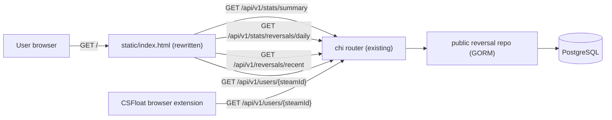

# PRD — Reverse Watch dashboard

**Version:** 1.0 (draft)
**Status:** Draft — awaiting confirmation on open items in §14.
**Owner:** Morten Byskov
**Last updated:** 2026-05-22
**Linear:** TBD
**Production target:** `[reverse.watch](https://reverse.watch)` (root path)
**Repo:** `[csfloat/reverse-watch](https://github.com/csfloat/reverse-watch)` (master `df93823…`)

---

## 1. Product overview

### 1.1 Vision

Turn `reverse.watch` from a single-purpose Steam-ID lookup into the canonical public dashboard for Steam trade-reversal activity. Anyone — a CS2 trader spooked by a fresh Valve update, a competing marketplace, a community-site operator — should be able to land on `reverse.watch` and immediately see (a) overall reversal volume across the ecosystem, (b) trends over time, and (c) recent reversal activity. The Steam-ID lookup stays as a primary action.

### 1.2 Problem

Right now `reverse.watch` answers exactly one question: "has this specific Steam ID been reversed?" That's useful but narrow. It misses the more interesting product surface:

- **Macro signal.** When Valve ships an update or a wave of fraud rolls through Steam, traders have no public way to see whether reversal volume is spiking. They guess from Reddit threads.
- **Trust building.** A live, populated dashboard signals that the database is real and contributed to. An empty homepage with just a search box does not.
- **Discoverability.** Users who don't already have a specific Steam ID in mind have no reason to visit. A dashboard gives them one.

### 1.3 Goals


| #   | Goal                                                      | Success metric                                                                  | Baseline status                                                          |
| --- | --------------------------------------------------------- | ------------------------------------------------------------------------------- | ------------------------------------------------------------------------ |
| G1  | Make `reverse.watch` a destination — not just a lookup    | 30-day average DAU on `/` increases ≥3× post-launch                             | **Baseline pending** — no analytics on `reverse.watch` today (needs G4). |
| G2  | Surface ecosystem-level reversal trends                   | Daily-bucket chart loads in <500ms p95; chart visible above the fold on desktop | N/A — endpoint doesn't exist yet                                         |
| G3  | Preserve the single-Steam-ID lookup as the primary action | Lookup latency unchanged (<200ms p95); search box still hero on the page        | Existing endpoint is `<TBD>` p95 — needs measurement                     |
| G4  | Add basic web analytics so we can measure G1–G3           | PostHog or equivalent event tracking landed in the same release                 | None today                                                               |


### 1.4 Non-goals (v1)

- Authenticated user accounts, saved searches, or notifications.
- Per-marketplace breakdowns on the chart (single line, total volume only — defer to v1.1).
- Per-source breakdowns (`direct` / `related_user` / `user_report`) on the chart.
- A new public marketplace registry endpoint — slug → display name + icon stays hardcoded in the frontend for v1.
- New database tables, new Postgres indexes (deferred — see §9.2 if needed).
- Mobile app integration. The CSFloat browser extension already integrates via `/api/v1/users/{steamId}` and that contract is unchanged.
- Internationalisation. English only. The repo has no Crowdin wiring.
- Light theme. Razvan's mockups are dark only — confirmed scope.

---

## 2. Target users & personas


| Persona                  | Description                                                                                         | Primary need                                     |
| ------------------------ | --------------------------------------------------------------------------------------------------- | ------------------------------------------------ |
| **Concerned trader**     | A CS2 player worried after a Valve update or trade-hold change. Lands from a Reddit / Discord link. | "Are reversals spiking right now?"               |
| **Marketplace operator** | A competing marketplace or trading-tool operator considering contributing reports.                  | "Is this database real and active?"              |
| **Community researcher** | A power user, journalist, or YouTuber writing about trade fraud.                                    | "Show me a number I can cite."                   |
| **Existing lookup user** | Someone already on `reverse.watch` to check a specific Steam ID.                                    | Search box stays where it is and works the same. |


---

## 3. Architecture

### 3.1 Where the code lives

Single repo: `[csfloat/reverse-watch](https://github.com/csfloat/reverse-watch)`. One Go binary. One static HTML file at `[static/index.html](https://github.com/csfloat/reverse-watch/blob/master/static/index.html)`. No frontend build step, no new service, no new repo.

### 3.2 Stack

- **Backend**: Go 1.24+ — chi router, GORM, PostgreSQL. Same as today.
- **Frontend**: a single self-contained HTML file with inline CSS + inline JS. Convention from the existing `static/index.html` is preserved. Charting library loaded from CDN — see §6.4.
- **No backend service additions.** No new Postgres tables. No schema changes.

### 3.3 System diagram




### 3.4 Why no schema or model changes

The existing `Reversal` model already has every field we need: `steam_id`, `marketplace_slug`, `source`, `related_steam_id`, `reversed_at` (ms epoch), `expunged_at` (nullable ms epoch), `created_at`, `updated_at`. Aggregations are read queries against the existing table. v1 ships entirely as additive routes + repo methods + a static HTML rewrite.

### 3.5 Local data source for v1

The dashboard runs on **dummy data sourced from the Google Sheet** (`1ccGoHiqXTpjy_jtHSOW3QmrNFP2jvfOsqyWFpNBz-UA`, the 100-row CSFloat export covering 2026-05-15 → 2026-05-18). This applies to **local development and staging only**. Production at `reverse.watch` is unchanged — it continues to ingest live data from contributing marketplaces via the existing pipeline.

Implications for v1:

- A small ingest script seeds local Postgres from the Sheet (`internal/devseed/sheet.go` — see HANDOFF §5).
- Local KPIs and the 30-day chart show **sparse, narrow data** — every row is `marketplace_slug=csfloat`, `source=direct`, no expungements, only 3 days of activity. Expected and acceptable for v1.
- Tests use `pgtestdb` with inline fixtures — independent of the seed.
- **No synthetic data generator.** Dense-data demo screenshots are a v1.1 concern if needed. v1 ships with whatever the Sheet contains.

---

## 4. Information architecture


| Route                           | Purpose                                          | Auth                |
| ------------------------------- | ------------------------------------------------ | ------------------- |
| `/`                             | Public dashboard (rewritten)                     | Public              |
| `/api/v1/users/{id}`            | Single Steam-ID lookup (existing, unchanged)     | Public, IP-limited  |
| `/api/v1/stats/summary`         | Three KPI numbers in one call (new)              | Public, IP-limited  |
| `/api/v1/stats/reversals/daily` | Daily-bucket chart series (new)                  | Public, IP-limited  |
| `/api/v1/reversals/recent`      | Recent reversals for the table (new)             | Public, IP-limited  |
| `/api/v1/reversals` (auth)      | Existing `export`-permission listing (unchanged) | Bearer + permission |
| All other existing routes       | Unchanged                                        | As today            |


The dashboard is a single page. No `/about`, no `/dashboard`, no other public routes added.

---

## 5. Data model

No changes. Reusing existing `[domain/models/reversal.go](https://github.com/csfloat/reverse-watch/blob/master/domain/models/reversal.go)`:

```go
type Reversal struct {
  Model                       // snowflake ID, created_at, updated_at (ms epoch)
  SteamID         SteamID
  MarketplaceSlug string
  Source          *Source     // nil | direct | related_user | user_report
  RelatedSteamID  *SteamID    // only set when Source == related_user
  ReversedAt      uint64      // ms epoch (when the trade actually reversed)
  ExpungedAt      *uint64     // nil = active; non-nil = soft-deleted by reporter
}
```

All v1 read queries filter `expunged_at IS NULL` unless explicitly noted. Expunged rows are hidden from the public dashboard.

---

## 6. Feature inventory (v1)

Razvan's mockups are the source of truth for layout and copy.  
Desktop: `[design/01-default.png](design/01-default.png)`, `[design/02-clear.png](design/02-clear.png)`, `[design/03-flagged.png](design/03-flagged.png)`.  
Mobile: `[design/04-mobile-clear.png](design/04-mobile-clear.png)` (clear state only — default and flagged mobile mocks are pending from Razvan, see §14).

### 6.1 Page sections (top to bottom)

1. **Hero** — "Powered by CSFloat" badge, title "The open trade reversal database", one-sentence subtitle, Steam-ID search input, search button.
2. **Search result chip** — appears below the search input after a query (existing behavior, restyled). Two states from the mockups: *Clear* (green "No Reversals Found") and *Flagged* (red "Reversals Found").
3. **KPI cards** — three side-by-side cards: "Traders Indexed", "Traders Flagged", "Traders Flagged (24h)". Definitions in §6.2.
4. **Reversal Graph** — title "Reversal Graph · Last 30 days", one-sentence subtitle, single-line chart of daily reversal counts.
5. **Recently Reported Reversals** — title, one-sentence subtitle, table with columns Trader / Steam ID / Date Added, "Load More" button.
6. **Footer** — "What is reverse.watch?" + "Want to contribute?" copy blocks, "Get the extension" CTA, "Powered by CSFloat" lockup.

### 6.2 KPI definitions

These are the three numbers in the cards. Locking these requires a sign-off from Zachary because the existing repo doesn't enshrine these definitions anywhere — see §14.


| KPI                       | Working definition (v1 proposal)                                                                                                       | SQL sketch                                                                                                                |
| ------------------------- | -------------------------------------------------------------------------------------------------------------------------------------- | ------------------------------------------------------------------------------------------------------------------------- |
| **Traders Indexed**       | Distinct `steam_id`s that have ≥1 row in `reversals`, including expunged. Captures the total population the database has ever touched. | `SELECT COUNT(DISTINCT steam_id) FROM reversals;`                                                                         |
| **Traders Flagged**       | Distinct `steam_id`s that currently have ≥1 non-expunged reversal. Matches the existing `/users/{steamId}` "has reversed" logic.       | `SELECT COUNT(DISTINCT steam_id) FROM reversals WHERE expunged_at IS NULL;`                                               |
| **Traders Flagged (24h)** | Distinct `steam_id`s with a non-expunged row whose `created_at` is within the last 24 hours. Reads as "newly flagged today."           | `SELECT COUNT(DISTINCT steam_id) FROM reversals WHERE expunged_at IS NULL AND created_at >= NOW() - INTERVAL '24 hours';` |


> The 24h KPI uses `created_at` (when the row was reported), not `reversed_at` (when the trade actually reversed), because the card reads as "what happened today" and reporters can backfill `reversed_at` to weeks ago. Confirm with Zach in §14.

### 6.3 Reversal Graph — `GET /api/v1/stats/reversals/daily`

**Request:**

```
GET /api/v1/stats/reversals/daily?days=30
```

- `days` is optional. Default `30` (matches Razvan's mockups). Allowed values: `30`, `60`, `90`. Other values → `400 Bad Request`. Restricting to a small enumerated set lets us cache trivially (see §9). The 60 and 90 values are not used by the v1 frontend but cost ~nothing to support and pre-position us for v1.1.

**Response:**

```json
{
  "data": [
    { "date": "2026-02-22", "count": 12 },
    { "date": "2026-02-23", "count": 18 }
  ]
}
```

**Bucketing rules:**

- Bucket by `reversed_at` (per Morten's brief), in **UTC**.
- Excludes rows with `expunged_at IS NOT NULL`.
- Returns one entry per day in the window, including days with `count: 0` (no gaps — easier for the frontend chart).
- Window is `[NOW() - days, NOW()]` in UTC at request time.

### 6.4 Recently Reported Reversals — `GET /api/v1/reversals/recent`

**Request:**

```
GET /api/v1/reversals/recent?limit=100
```

- `limit` optional. Default `100`. Max `100`. Other values → `400`.

**Response:**

```json
{
  "data": [
    {
      "marketplace_slug": "csfloat",
      "steam_id": "76561198000000000",
      "reversed_at": 1779840000000,
      "created_at": 1779843600000
    }
  ]
}
```

**Rules:**

- Order: `created_at DESC` (newest reports first — matches "Date Added" semantic).
- Excludes rows with `expunged_at IS NOT NULL`.
- Slim public projection: only the fields needed for the table. Notably no `id`, no `source`, no `related_steam_id` — those ride on the auth-gated `/api/v1/reversals` endpoint and don't belong on the public surface.
- "Load More" pagination is **deferred to v1.1**. v1 fetches the latest 100 once and renders. The button shows but is `disabled` with a tooltip "More coming soon" — or removed entirely. Decide in HANDOFF §3.

### 6.5 Single-Steam-ID lookup (existing, unchanged)

`[GET /api/v1/users/{steamId}](https://github.com/csfloat/reverse-watch/blob/master/api/v1/users/users.go)` — unchanged. The new homepage rewires the existing form to it. Result chip below the search input adopts the new visual treatment from the *Clear* and *Flagged* mockups.

### 6.6 KPI summary endpoint — `GET /api/v1/stats/summary`

**Request:**

```
GET /api/v1/stats/summary
```

**Response:**

```json
{
  "traders_indexed": 25678,
  "traders_flagged": 15536,
  "traders_flagged_24h": 6456
}
```

One round-trip for all three KPI cards. Cached server-side (see §9).

### 6.7 Marketplace display registry

The "Trader" column shows a marketplace logo + display name (e.g. "RZBO" with an icon) for each row. v1 hardcodes a slug → `{name, iconUrl}` map inside the static HTML. The currently-known marketplaces are sparse enough that this stays maintainable. Promotion to a public `GET /api/v1/marketplaces` endpoint is v1.1 scope — see §12.

If the frontend encounters an unknown slug it falls back to rendering the slug verbatim with a generic icon.

---

## 7. Non-functional requirements

### 7.1 Performance

- All four GET endpoints serving the dashboard return in **<500ms p95** under steady-state production traffic.
- Page LCP **<2.5s on 4G mobile**.
- The chart renders without layout shift (CLS <0.1) — reserve the chart container's height before the data lands.

### 7.2 Caching

The KPI summary and daily-bucket endpoints are stale-tolerant:

- In-process cache with a 60-second TTL on `/api/v1/stats/summary` and `/api/v1/stats/reversals/daily` (per `days` value). Standard-library `sync.Map` + `time.Time` is enough — don't pull in Redis. Existing `ratelimit/` package shows the in-process precedent.
- `/api/v1/reversals/recent` is **not** cached — the table should reflect new reports within seconds.
- `/api/v1/users/{steamId}` is unchanged.

### 7.3 Rate limits

All new public endpoints:

- IP-throttled via the existing `[ratelimit.ThrottleByIP](https://github.com/csfloat/reverse-watch/blob/master/ratelimit/ratelimit.go)`.
- Suggested: 60 req/minute/IP for stats endpoints, 30 req/minute/IP for `/reversals/recent`. Tune in HANDOFF §3.

### 7.4 Browser support

Latest 2 versions of Chrome, Edge, Firefox, Safari (desktop + iOS/Android). The mockups are dark-only — no light theme.

### 7.5 Accessibility

- Color contrast ≥ WCAG AA on the dark theme.
- Search input is the first focusable element.
- Chart has an accessible text alternative (e.g. "Reversal volume over the last 30 days, peaking at X on YYYY-MM-DD").
- Table is a real `<table>` with proper `<thead>`/`<th scope="col">`. Not a div soup.

---

## 8. Security & privacy

The repo is open-source by design, the dataset is openly contributed by participating marketplaces, and the Steam IDs in it are already retrievable today via the existing `/users/{steamId}` lookup. So strictly speaking we are not exposing new data. We are exposing the existing data in aggregated and recency-ordered form.

That said, two things deserve a check:

1. **Public listing of recently flagged Steam IDs.** Today you have to know the Steam ID to check it. After v1, you can browse the 100 most-recently flagged Steam IDs without knowing any of them up front. Defaulting to **unmasked** to match the design mockups.
2. **Rate limits matter more.** The new endpoints are scrape-friendly. The existing `ratelimit` package handles this; just make sure the limits in §7.3 ship from the start.

No PII beyond Steam IDs (which are public-by-design Valve identifiers). No cookies, no user accounts, no auth, no tracking pixels added in v1.

---

## 9. Analytics & telemetry

Today `reverse.watch` has no analytics. We can't measure G1, G2, or G3 without something. Options:


| Option                                                                                                                                    | Pro                                                                       | Con                                                                                                                   |
| ----------------------------------------------------------------------------------------------------------------------------------------- | ------------------------------------------------------------------------- | --------------------------------------------------------------------------------------------------------------------- |
| **PostHog** via existing `science.csfloat.io` proxy (`[csfloat/posthog-reverse-proxy](https://github.com/csfloat/posthog-reverse-proxy)`) | Same stack as the rest of CSFloat. Free as long as we stay in the budget. | Couples a public open-source repo to an internal PostHog project. Ad blockers — though the proxy partly handles this. |
| **Plausible / Umami** self-hosted                                                                                                         | Lightweight, no third-party calls.                                        | New infra to operate.                                                                                                 |
| **Server-side counters in the API binary**                                                                                                | Zero new infra. Already have logging.                                     | Doesn't capture pageviews, doesn't capture extension users.                                                           |


**Recommendation:** PostHog via the existing proxy, mirroring `phoenix`. Light event set:


| Event                 | Where                          | Why                                  |
| --------------------- | ------------------------------ | ------------------------------------ |
| `dashboard_viewed`    | static/index.html on load      | DAU on `/`                           |
| `lookup_submitted`    | search form submit             | G3 — lookup is still primary         |
| `lookup_result_shown` | API response render            | Clear vs flagged ratio               |
| `extension_cta_click` | "Get the extension" link click | Top-of-funnel for extension installs |


Confirm with Zach in §14 before wiring.

---

## 10. Roadmap

### v1.1 (post-launch hardening, ~2–4 weeks out)

- "Load More" on the recent-reversals table — exposes the existing cursor pagination from `dto.ReversalListOptions` to the public endpoint.
- Info chip on graph: let the user see if Valve released something important on a specific date. (Morten should be able to simply add info via an .md file in this project) 
- Live counter for the 3 main KPIs 
- Per-marketplace breakdown toggle on the daily chart.
- Per-source breakdown (`direct` / `related_user` / `user_report`) — useful signal for understanding reporting quality.
- Public `GET /api/v1/marketplaces` so the slug → name/icon mapping stops living in the frontend.
- Steam ID display: link to Steam profile (`https://steamcommunity.com/profiles/{steamId}`) on the table rows.

### v1.2 (signal & trust)

- Daily ETag / Last-Modified on stats endpoints so CDN caching works.
- Sparkline embeds (e.g. ``) so partner sites can drop a tiny chart into their own pages — light viral surface.
- Reverse-watch RSS / Atom feed of recent reversals.

### v2 (stretch)

- Authenticated views for marketplace operators (e.g. "your reversals over time"). Requires reusing the existing API-key auth as a session model — non-trivial.
- A Discord webhook channel for high-volume days ("reversal volume up X% over 7-day average").

---

## 11. Acceptance criteria (launch)

- `https://reverse.watch/` renders the new layout: hero + search + KPI cards + chart + recent table + footer.
- Searching a Steam ID still works end-to-end and produces either the *Clear* or *Flagged* result chip below the search input.
- All three new endpoints respond <500ms p95 and return the contract in §6.
- All four public endpoints are IP-rate-limited.
- The chart shows the last 30 UTC days, with zero-count days included.
- The recent-reversals table shows the latest 100 non-expunged reversals ordered by `created_at DESC`.
- Lighthouse Performance + Accessibility ≥ 90 on the homepage (desktop + mobile).
- README in the repo is updated with how to run the seed scripts locally.
- PostHog is firing `dashboard_viewed` and `lookup_submitted`.

---

## 12. Test plan

### Unit / repo

Mirror existing patterns in `[repository/public/reversal_test.go](https://github.com/csfloat/reverse-watch/blob/master/repository/public/reversal_test.go)` using `pgtestdb` from `[internal/testutil/db.go](https://github.com/csfloat/reverse-watch/blob/master/internal/testutil/db.go)`:

- `DailyCounts(days)` — fixture: rows across 100 days with some expunged, some on the boundary, one in the future. Assert: only `[NOW()-days, NOW()]`, only non-expunged, zero-count days included.
- `SummaryStats()` — fixture covering each KPI's edge cases. Assert: `traders_indexed` includes expunged, the other two don't.
- `ListRecent(limit)` — fixture with mixed `created_at`. Assert: ordered desc, expunged excluded, capped at limit.

### API

Mirror existing patterns in `[api/v1/reversals/reversals_test.go](https://github.com/csfloat/reverse-watch/blob/master/api/v1/reversals/reversals_test.go)`:

- 200s with the documented JSON shape.
- 400 on out-of-range `days` and `limit`.
- 429 once rate limit is exceeded.

### Browser smoke (local)

- Run with the synthetic seed (1k rows). Visually compare against the three Razvan mockups.
- Run with sheet-seeded real data once available. Confirm the dashboard handles ~100 rows gracefully (chart with sparse days, table not over-padded).

---

## 13. Handoff / Linear

- Linear parent issue: **CSF-1518**, link here: [https://linear.app/csfloat/issue/CSF-1518/improve-reversewatch](https://linear.app/csfloat/issue/CSF-1518/improve-reversewatch)
- Owner: Morten Byskov.
- Reviewer / approver: Zach and Stepan (since `reverse-watch` is a public CSFloat repo and this changes its public surface).
- Engineering pairing: TBD — extension owner is Stepan, repo author also Stepan / Ceegan. Coordinate on PR review path before merging.
- Sub-issues to open under the parent:
  1. PR #1 — daily-buckets endpoint + `SummaryStats` + recent-reversals endpoint + repo methods + tests.
  2. PR #2 — static/index.html rewrite to consume them.
  3. PR #3 — analytics wiring (PostHog or chosen alternative).
  4. (Tracking) Local seed scripts + README update.

---

## 14. Open items — confirm before merging PR #1

These are the items where I'm flagging assumptions rather than asserting facts. Confirm or correct before we lock the PRD.

1. **KPI definitions** (§6.2). Especially: does "Traders Flagged (24h)" mean 24h by `created_at` (newly reported) or 24h by `reversed_at` (recently reversed)?
2. **Public exposure of recent-reversals table** (§8). Default is unmasked Steam IDs to match the design. That is okay for now.
3. **Analytics choice** (§9). We will use PostHog via `science.csfloat.io`.
4. **Marketplace registry** (§6.7). Hardcoding slug→{name, icon} in the frontend is fine for v1. Confirm we don't already maintain this mapping somewhere reusable inside CSFloat (e.g. an internal config in `nezha`). **Unverified by me — Knowledge folder doesn't cover this.**
5. ~~**Google Sheet access**~~ — **resolved 2026-05-22.** Read 100 real rows from sheet `1ccGoHiqXTpjy_jtHSOW3QmrNFP2jvfOsqyWFpNBz-UA` (Studio export, 2026-05-15 → 2026-05-18). Schema matches `models.Reversal` 1:1. Dataset is single-marketplace (`csfloat`) and single-source (`direct`) only — fine as a fixture, not representative for breakdown features (already deferred to v1.1). Note: 2 of 100 `steam_id` cells were truncated to scientific notation (`7.65612E+16`) by Google Sheets formatting — the ingest path must use `UNFORMATTED_VALUE` (Sheets API) or a text-formatted column on CSV export.
6. **Razvan design fidelity**. Dark theme confirmed (no light variant). Will not have lightmode for this. One mobile mockup received (`[design/04-mobile-clear.png](design/04-mobile-clear.png)`) — covers the clear-state result chip only. **Mobile default and mobile flagged states are pending** before we touch PR #2 (frontend rewrite). Filed back to Razvan.

---

*End of PRD. See `[HANDOFF.md](HANDOFF.md)` for the engineering build plan.*